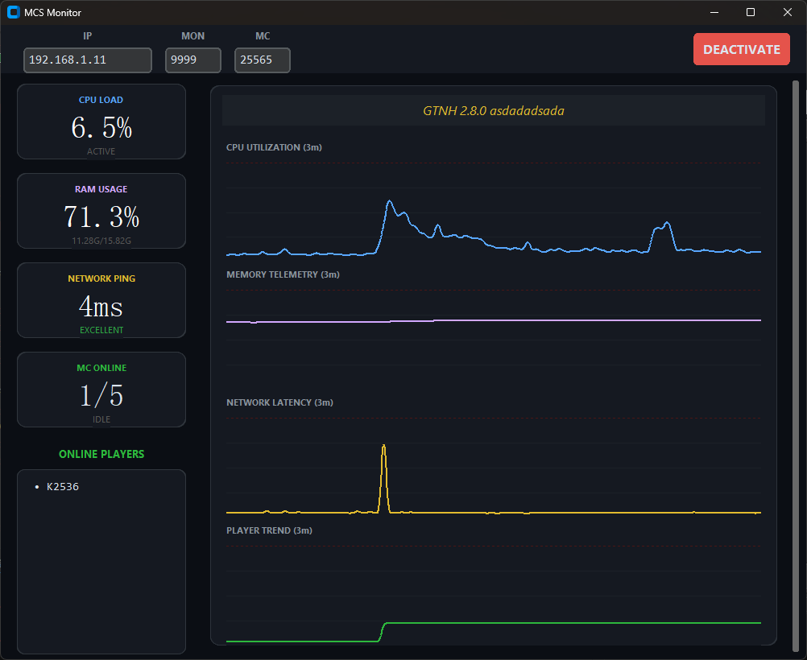

# MCS Monitor
Minecraft Server Monitor  
A lightweight monitoring panel for monitoring the resource usage of MC server and the running status of the game server.  
一款轻量级监控面板，用于监视我的世界服务器资源占用和游戏服务器运行状态。

Screen Shot / 截图  

  

Features / 特性  
Integrated with the functions for monitoring the resource usage and status of Mincraft server, with a simple and clear GUI interface and trend charts such as CPU/RAM usage, online players.  

Setup / 安装  
pip install customtkinter psutil mcstatus

How to Use / 使用  
Server: Run main.py -> SERVER MODE -> Set Port -> START.  
Client: Run main.py -> CLIENT MODE -> Input IP/Ports -> ACTIVATE.

Tips / 提示  
You can simply input either the "monitor" or "mc" port, and use it as a standalone resource monitor or a monitor for the status of the MC server.
